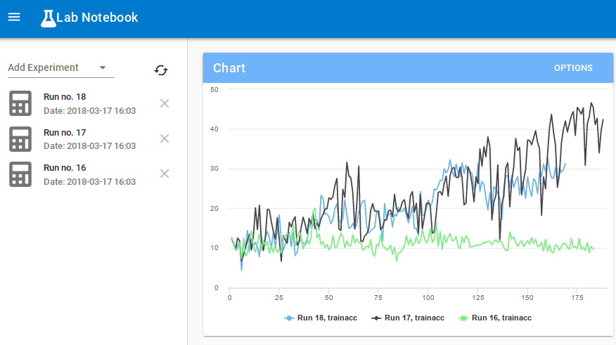

# LabNotebook
## A simple experiment manager for deep learning experiments

`labnotebook` allows you to:
- flexibly save **all** your experimental data in a postgres database through a very simple interface, including configuration, models, results, and training curves.
- monitor **any** indicators from your running experiments by streaming them through a web application:

- access all this data forever through the web app, through [sqlalchemy](https://www.sqlalchemy.org/), or through traditional sql text queries.

All you need to do is to modify your code to include `labnotebook.start_experiment()` and `labnotebook.stop_experiment()` and pass the info you would like to save to the database as arguments. As an option, you can save information for each training step by using `labnotebook.step_experiment()`.

You can see a very simple example notebook [here](./nbs/basic_usage.ipynb).

Another example of how to log while training a ConvNet in PyTorch is [here](./nbs/mnist.ipynb).

## Why labnotebook?

In the life sciences, scientists write everything in their [lab notebooks](https://en.wikipedia.org/wiki/Lab_notebook). I wanted a similar permanent store for my PyTorch experiments that allowed me to:
- asynchronously look at what was going on. [TensorBoard](https://www.tensorflow.org/programmers_guide/summaries_and_tensorboard) obviously provides excellent functionality, albeit with an interface and storage system that I didn't especially like. It's very hard to keep track of all the indicators of old experiments and to compare them to newer experiments.

- store everything forever in a queryable database. [Sacred](https://github.com/IDSIA/sacred) provides some of this functionality, but the interface is complex and inflexible. In addition, I think experimental data is relational data intermixed with nosql data, and postgres is better adapted to the type of queries for this kind of experimental data.

For a quick read on the tech stack choices I made, check out my [blog post](https://henripal.github.io/blog/labnotebook).

# Installation

### Set up a postgres database:

Follow the [detailed installation guides](https://wiki.postgresql.org/wiki/Detailed_installation_guides), create your database, and make a note of your database's url. It's usually of the form `postgres://<username>:<password>@localhost/<databasename>`.

Note you need version 9.4+.

### Install labnotebook:

Clone the repository:

```
git clone https://github.com/henripal/labnotebook.git
```

Enter the directory and install labnotebook locally:
```
cd labnotebook
pip install .
```

### Start the API:

Once you've installed the package, you can run the following command on your database url to start the API:
```
start_backend <database_url>
```

### Start the webapp:

Navigate to the `frontend` directory and serve it; for example using python 3's http.server:
```
cd frontend
python -m http.server
```

Then open the serving address and port, typically `http//localhost:8000` if you're using the python server.

# Usage and Documentation:

A simple example notebook is available [here](./nbs/basic_usage.ipynb).

A more realstic example, training a convolutional neural network on MNIST in PyTorch and logging with `labnotebook` is available [here](./nbs/mnist.ipynb).

# Limitations and To Dos:

This is a very early alpha version of the tool that I'd thought some people might enjoy. I haven't tested it on older browsers or frameworks. 
For now I've tested this only on Ubuntu, with PyTorch-style experiments, using chromium.
I'm happy to get any feedback of how this runs on other platforms! 

## Contribution!

I'm by myself working on this and there are bugs galore. Any contributions are welcome; let me know if you would like to contribute but not sure how to go about doing it, and I'll walk you through it!


# Attribution:

The front-end of this project uses [VueJS](https://vuejs.org/), [Vuetify](https://vuetifyjs.com/en/) and [Highcharts](https://www.highcharts.com/).

---

If you like this and want to be updated on what I'm doing, [follow me on twitter?](https://twitter.com/henripal)
